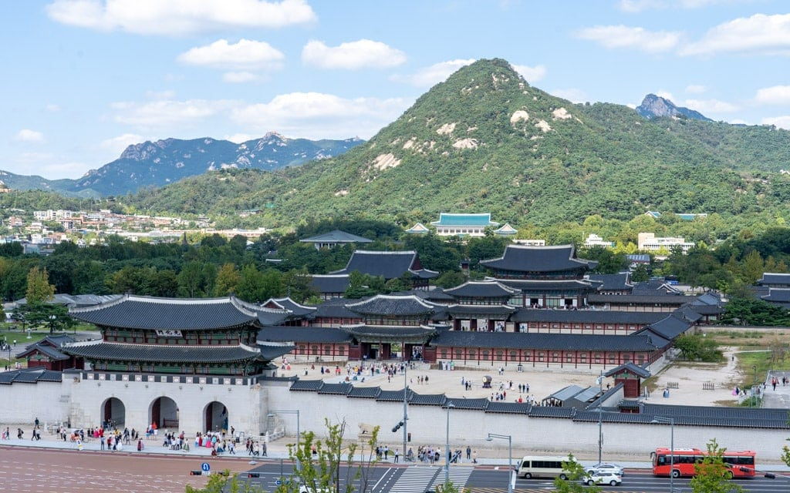
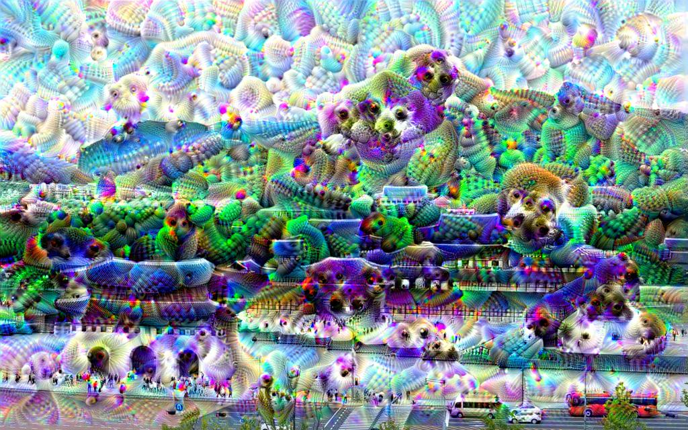
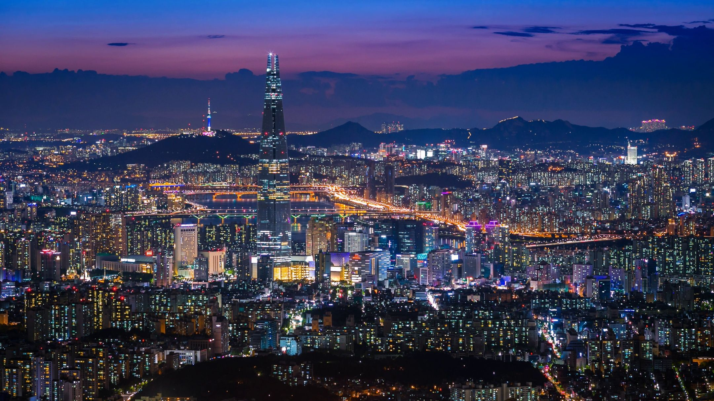
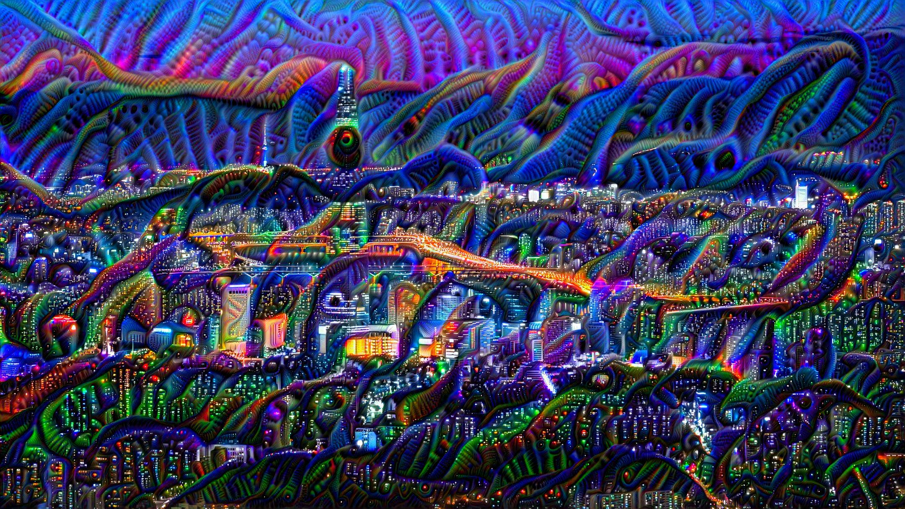
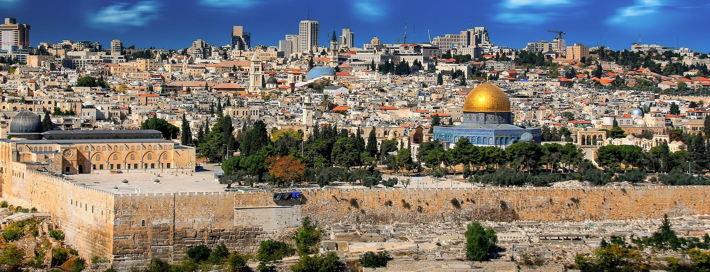
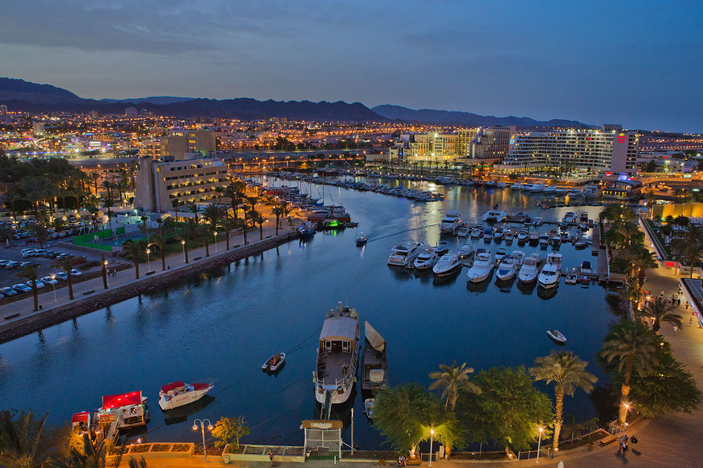
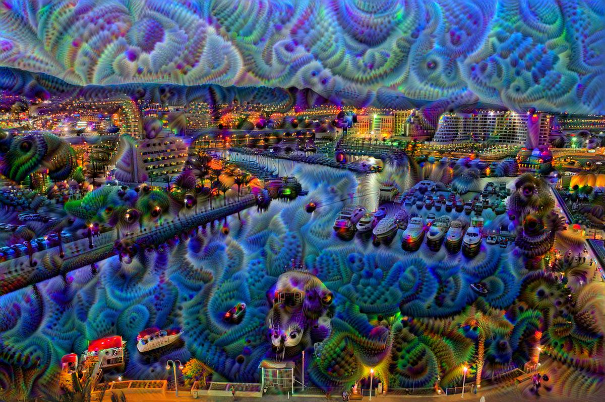

# Deep Dream
DeepDream using Tensorflow 2.3 
>     usage: deepdream.py [-h] --input_image INPUT_IMAGE [--output_dir OUTPUT_DIR]
>                         [--layer_names LAYER_NAMES [LAYER_NAMES ...]] [--lr LR]
>                         [--octave_scale OCTAVE_SCALE] [--num_octaves NUM_OCTAVES]
>                         [--iterations ITERATIONS]
>     
>     optional arguments:
>       -h, --help            show this help message and exit
>       --input_image INPUT_IMAGE
>                             Path to an input image
>       --output_dir OUTPUT_DIR
>                             Path to a directory where the output will be saved.
>                             Default: Same directory in 'outputs' dir.
>       --layer_names LAYER_NAMES [LAYER_NAMES ...]
>                             Layer at which we modify image to maximize outputs.
>                             Choose either: 'mixed0', 'mixed1', ...,'mixed10' or any combination of them.
>                             Default: ['mixed3', 'mixed5']
>       --lr LR               Learning rate
>                             Default: 0.01
>       --octave_scale OCTAVE_SCALE
>                             Image scale between octaves
>                             Default: 0.75
>       --num_octaves NUM_OCTAVES
>                             Number of octaves; How many downsampling to do and
>                             apply DeepDream.
>                             Default determines the maximal num octaves possible.
>       --iterations ITERATIONS
>                             Number of Gradient Ascent steps per octave.
>                             Default: 10
>
>     
 
 
 
 